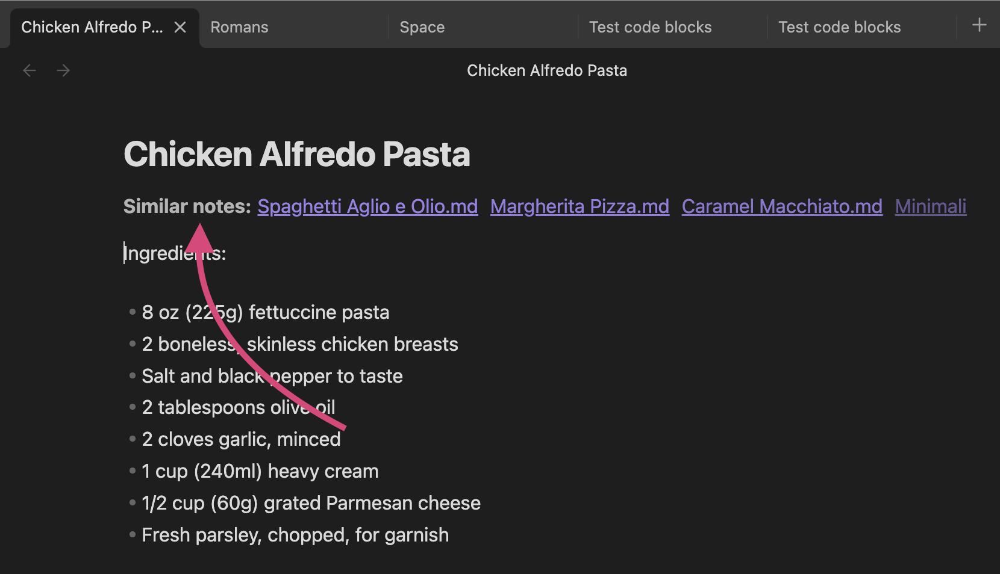
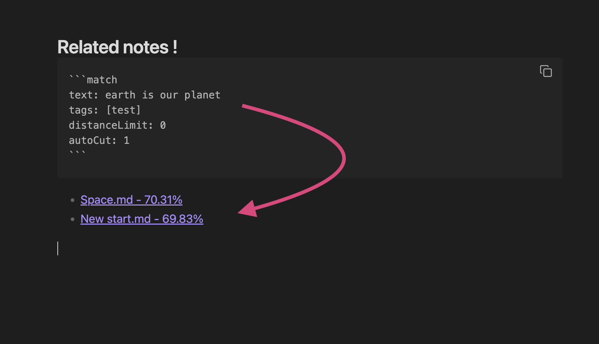
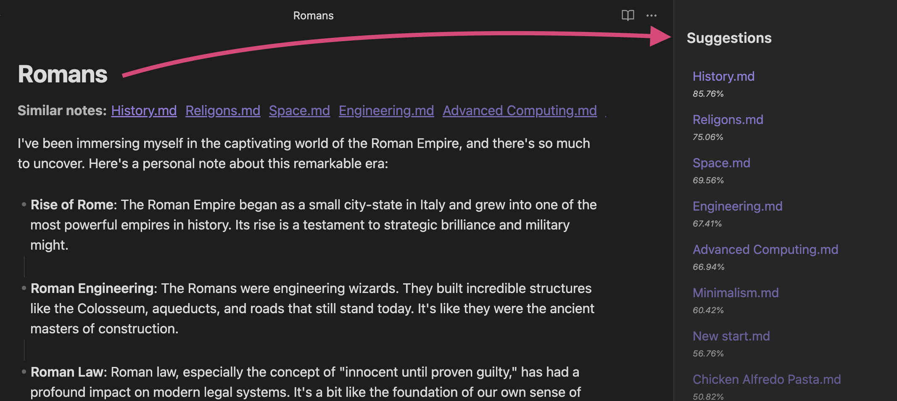
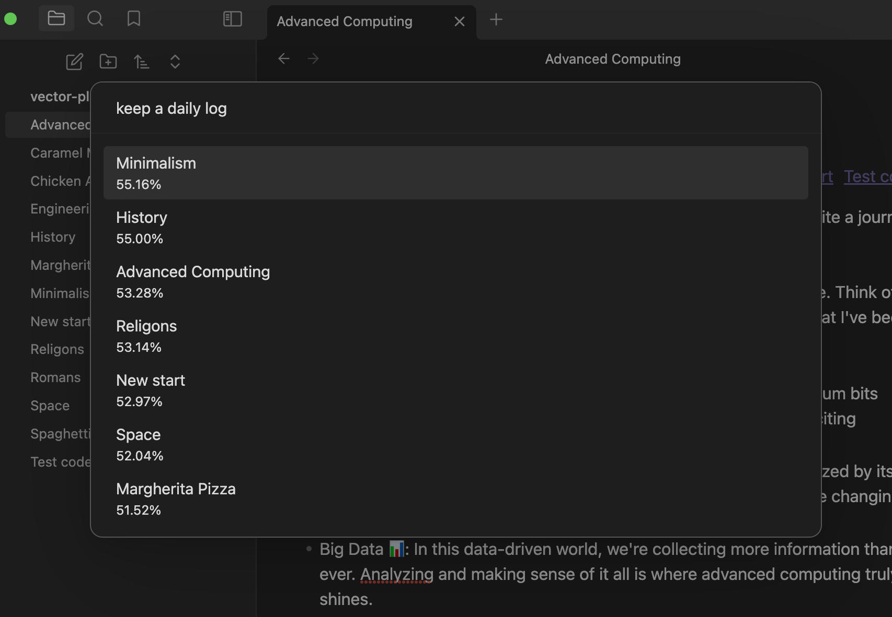

# Obsidian Semantic Search

A simple [Obsidian editor](https://obsidian.md/) plugin, featuring:

-   **Semantic search** over your notes
-   **Similar note suggestions** to make new connections
-   **Control over your data**:
    -   Locally hosted vector database: [Weaviate DB](https://weaviate.io/)
    -   Your choice of OpenAI-compatible embeddings providers

Forked from Faisal Saurav's excellent [AI Note Suggestions plugin](https://github.com/echo-saurav/obsidian-ai-note-suggestion).

## Warning

This repo is for personal testing. Eventually I'll try to make this user-friendly: but for right now, don't try to use this yourself unless you know what you're doing.

-   **This plugin is still in beta**. There are plenty of bugs and missing features.
-   **This plugin is not on the Obsidian plugin store**.
-   **This requires local setup**. Don't do this unless you have a decent knowledge of Docker and the CLI.

## Features

-   **AI-Powered Suggestions:** The plugin suggests similar notes based on the content you're currently typing.
-   **Related Notes:** Discover related notes that you might have missed, enhancing your note-taking context.
-   **Tag Filtering:** If you still prefer using tags, you can filter notes by tags as well.
-   **Quick search:** Also you can quickly search anytime with command palette






### Roadmap

-   [ ] Chunking for documents
-   [ ] [Embedded Weaviate](https://weaviate.io/developers/weaviate/installation/embedded) option for desktop, if you don't want to run a Docker instance
-   [ ] Suggested tags, from clusters

## Setup guide

> NOTE: This guide assumes you're a developer with some general knowledge. If you can't follow along, you probably should wait until this plugin is released.

### Installing this plugin

Prerequisites:

-   Git
-   node and npm

Clone this repo to the `.obsidian/plugins` folder in your vault. Make sure not to change the folder name: it must match the name in [`manifest.json`](https://docs.obsidian.md/Reference/Manifest).

Then:

```bash
npm i
npm run build
```

Go to the Community Plugins folder in Obsidian Settings and enable.

### Running the Weaviate database

Go to Semantic Search in the Obsidian settings and provide the base URL of a working [Weaviate](https://weaviate.io/) server.

You'll probably want to self-host a Weaviate instance using [Docker](https://www.docker.com/get-started/) and Docker Compose. This repo has some example Docker Compose stacks for you to run:

-   **Weaviate + [text-embeddings-inference](https://huggingface.co/docs/text-embeddings-inference/index)**: This stack allows you to vectorize your notes completely self-hosted (if you have an Nvidia GPU). The default model is [Nomic Embeddings v1.5](https://huggingface.co/nomic-ai/nomic-embed-text-v1.5). Go to `./infra/weaviate-tei` and run `docker compose up`. Default port is `localhost:3636`.

### Setting up embeddings provider

This repo accepts any OpenAI-compatible embeddings provider (more to come later). Note that right now chunking and caching aren't perfect, so it might get expensive. Put in the base URL and API key in settings.

## Usage

### Code blocks for query

This is a simple code blocks for querying similar notes based on given texts

````markdown
```match
text: one
limit: 10
distanceLimit: .98
autoCut: 2
```
````
